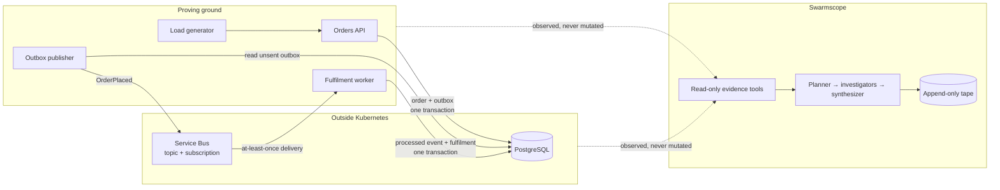

# Swarmscope

**A debugger for agent swarms.**

You cannot debug an agent system by reading its logs, because the interesting
question is never what it did — it is what it would have done instead.

Swarmscope records every model call and every tool call a swarm makes to an
append-only tape. Any run can be replayed exactly. You can then reach into a
recorded run, change one decision the swarm made — how it allocated attention,
what it was told, which evidence it reached for — re-run from that point, and
see what diverges. Did it still find the bug? Faster? Cheaper? Or did the
change quietly lose the answer?

Everything the counterfactual does that the original also did is served from the
tape, so the two runs are identical up to the first genuine divergence. Past
that point the run is a live continuation, and Swarmscope says so explicitly
rather than pretending the comparison is still controlled.

## Why it needs something to investigate

Scoring an investigation requires knowing the right answer in advance.

So Swarmscope ships with its own proving ground: a small event-driven order
system, built properly and then broken on purpose. Faults come from a fixed
catalogue with the root cause recorded before injection, so every run can be
scored against ground truth rather than judged by eye.

The application is deliberately small. Its failure semantics are not — a
transactional outbox, at-least-once delivery, lease-based recovery, and
idempotent consumption give an investigator real evidence to reason from and
real ways to be wrong.

## Architecture



Investigators get narrow, read-only tools. They are told the symptom, never the
fault — working backwards is the job.

### Two kinds of events

The word means two different things here, and conflating them would be a
design error:

- **Business events** flow through Service Bus between application services.
- **Investigation events** are appended to the tape, describing what an
  investigator observed. The tape is not a copy of the broker and does not
  replace the application's delivery guarantees.

## Current state

Built substrate-first, on the principle that an investigator is only as
credible as the system it investigates. The proving ground's delivery
semantics come first; the swarm and the tape follow.

**Proving ground**
- [x] Local PostgreSQL development stack
- [x] Versioned `OrderPlaced` event contract
- [x] Orders schema and migrations
- [x] Order and outbox event written in one transaction
- [x] `POST /orders` with correlation IDs
- [x] Isolated test database
- [x] Transport-neutral event publishing boundary
- [x] Outbox delivery state: attempts, scheduling, leases
- [x] Outbox publisher: claim, publish, record, retry with backoff
- [x] Terraform definition for the Azure Service Bus topology
- [x] Service Bus publisher using Microsoft Entra identity
- [x] Publisher process loop with graceful shutdown
- [x] Fulfilment schema: processed events and idempotency guards
- [ ] Fulfilment consumer with idempotent handling
- [ ] Load generator with repeatable traffic
- [ ] Fault catalogue with recorded ground truth

**The swarm and the tape**
- [ ] Read-only evidence tools
- [ ] Planner, investigators, and synthesizer
- [ ] Append-only tape of every model and tool call
- [ ] Deterministic replay of a recorded run
- [ ] Fork a recorded decision and diff the outcome
- [ ] Explicit first-divergence reporting
- [ ] Scoring against injected ground truth
- [ ] Control plane and interface

**Environments**
- [ ] Local Kubernetes rehearsal
- [ ] Azure deployment

An interactive mockup of the investigation interface — simulated data, no
backend — lives in [`docs/mockup/`](docs/mockup/index.html).

## The transactional outbox

An order and its `OrderPlaced` event are written in one database transaction,
so they cannot disagree. A separate process delivers the event afterwards, and
orders its steps so the only possible failure is a safe one:

1. claim one due event — **commit**
2. publish to the broker
3. record the publication — **commit**

A crash between 2 and 3 redelivers the event with the same `event_id`. That is
deliberate: at-least-once delivery with a stable identifier the consumer can
deduplicate on. Recording publication before sending would risk losing an event
outright, which is not recoverable.

Two independent protections guard a claim:

| Mechanism | Protects against | Lifetime |
|---|---|---|
| `FOR UPDATE SKIP LOCKED` | two workers claiming one row at the same instant | the claim transaction |
| Lease owner and expiry | a worker that died holding a claim | seconds; survives the crash |

Settling a claim is conditional on still owning the lease, so a worker whose
lease expired cannot overwrite the state of the worker that took over.

## Running it

Requires Docker and [uv](https://docs.astral.sh/uv/).

```bash
cp .env.example .env          # then set a local password
docker compose up -d          # PostgreSQL
uv sync
uv run alembic upgrade head
uv run uvicorn apps.orders.main:app --reload
```

Place an order:

```bash
curl -X POST localhost:8000/orders \
  -H 'content-type: application/json' \
  -d '{"customer_id":"c-1","sku":"widget-blue","quantity":2}'
```

The response carries a correlation ID that follows the order through the
database, the broker, and every log line.

### Tests

```bash
uv run ruff check .
uv run pytest
```

Tests create and migrate their own database on first run and never touch
development data. Tests that must prove committed behaviour commit for real;
the rest roll back.

## Layout

| Path | Contents |
|---|---|
| `apps/orders/` | Orders API, persistence, outbox publisher |
| `packages/contracts/` | Versioned event envelopes shared across services |
| `infra/azure/` | Terraform for Service Bus |
| `infra/local/` | Local PostgreSQL initialisation |
| `docs/mockup/` | Interactive mockup of the investigation interface |
| `tests/` | Test suite |
